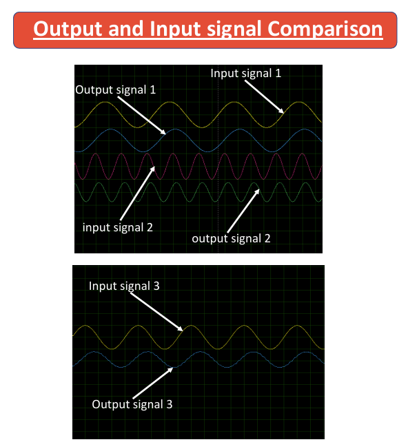

# TDM-PCM-System-Development-in-Proteus

This project presents the design and simulation of a **Time Division Multiplexing–Pulse Code Modulation (TDM-PCM)** system. It was developed as a sessional course project for **EEE 310 – Communication Laboratory** at the **Bangladesh University of Engineering and Technology (BUET)**.

###### **Key Features**

* **Multiple Signal Support:** Accepts multiple analog input signals simultaneously.

* **TDM Implementation:** Combines multiple signals into a single channel using time-division multiplexing.

* **PCM Encoding:** Performs sampling, quantization, and encoding of the multiplexed signal.

* **Digital Transmission:** Transmits encoded digital data through a shared channel.

* **Accurate Reconstruction:** Decodes the received signal back to analog form.

* **Channel Separation:** Successfully demultiplexes and retrieves individual signals at the receiver.

###### **System Overview**

Multiplexer/Demultiplexer: CD4051  

ADC: ADC0804 (8-bit)  

Parallel-to-Serial Converter: 74165  

Serial-to-Parallel Converter: 74HC595  

DAC: DAC0808 with Op-Amp  

Filtering: Two-stage RC Low Pass Filter  

Simulation Platform: Proteus

**Full Circuit in Proteus**

###### **Simulation Results**

* Multiplexed TDM signal observed at transmitter output

* PCM-encoded digital bitstream transmission

* Accurate analog signal reconstruction at receiver

* Successful separation of original input channels

* Minor attenuation handled using low-pass filtering

###### **Project Impact**

This project demonstrates the fundamental principles of **digital communication systems**, including multiplexing, PCM encoding/decoding, and signal reconstruction. It provides a strong practical foundation for understanding bandwidth efficiency and multi-user communication systems.

###### **Project Status**

✅ Completed — Functional simulation verified in Proteus  

🔧 Future Scope: Higher clock rates, improved filtering, and hardware implementation

###### **Contributors**

Sanath Kumar Das (1706149), Md. Rokonujjaman (1706150), Md. Tajbid Zaman Rhythm (1706152), **Joy Saha (1706189)**  

Department of Electrical \& Electronic Engineering, Bangladesh University of Engineering and Technology (BUET)

###### **License**

This project is for academic and educational purposes only.

